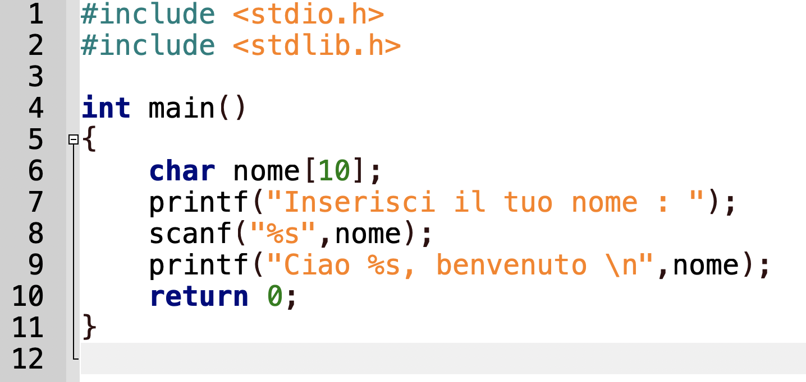
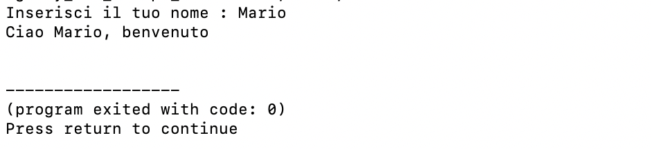

# Code-C-and-CPP
Codici elementari di C, Ordinamento Vettori ... Struct e Liste.
Questi codici sono stati realizzati come passatempo in seguito a richieste pervenuti da amici in collaborazioni con loro 

## Badges
 

### Annunci / Status del progetto
Questi codici sono esempi facoltativi di programmazione basilare in linguaggio ***C++*** 

## Documenti
* Gestione Aerei - Esempio di Union in C++
* Prodotto Prezzo - Esempio di gestione di array e ordinamento di array (bubbleSort,...)
* file_binari_struct - Esempio di gestione struct, lettura e scrittura su file txt 
* file_binari - Esempio di gestione liste, lettura e scrittura su file txt 
* struct-libreria - Esempio di gestione struct, lettura e scrittura su file binario
* ricorrenze - Elimina le ricorrenze in un vettore creandone uno secondario
* alterna - Dati due vettori di medesima dimensione crea un terzo vettore popolandolo in maniera alternata
* menu - costruzione e implementazione elementare di un menu in C 

# Benvenuti

### Come iniziare
Basta soltanto tanta voglia di imparare e di condividere, nulla piu'

### Cosa installare
Geany, DevC++ o tanti altri Editor e un compilatore 

#### Segnalazione bug e richieste di aiuto
Nel caso di problematiche o vulnerabilità in questi codici, vi prego di segnarlo
Potete utilizzare lo strumento messo appunto a disposizione da **GITHUB**

#### Autori e Copyright

- Denis B. - USER ID : denisberno - [denisberno](https://github.com/denisberno) per visionare invece il repository [REPOSITORY](https://github.com/denisberno/Code-C-and-CPP)
- Amici  
